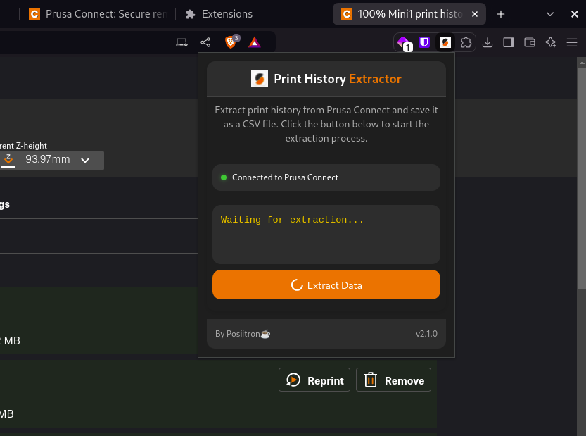
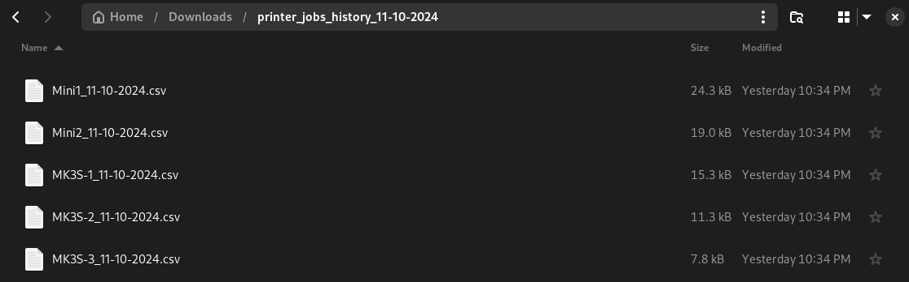
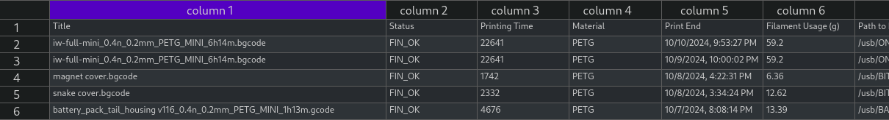
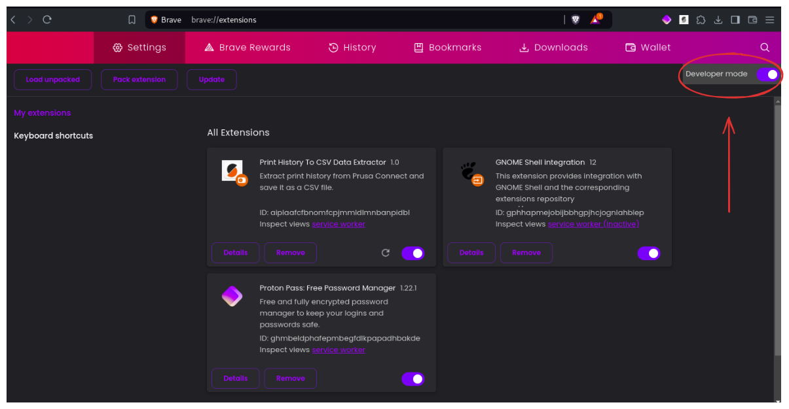
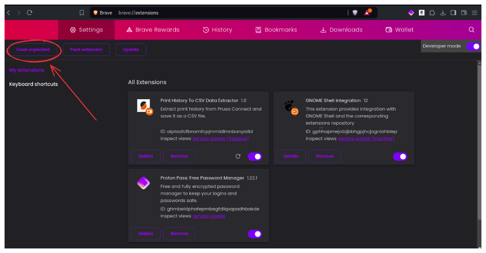
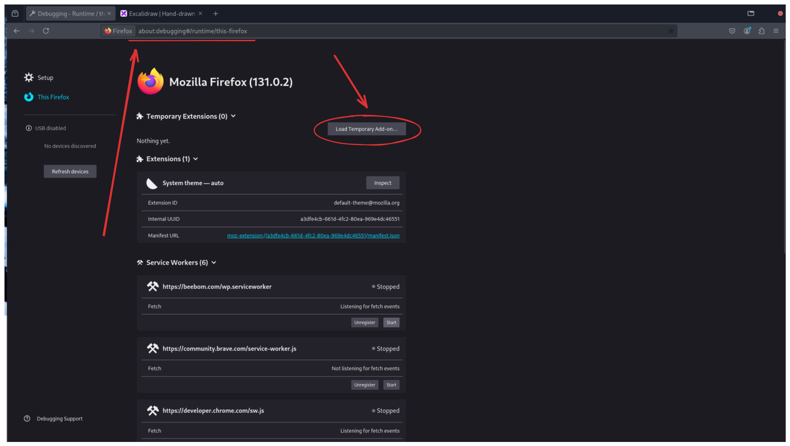
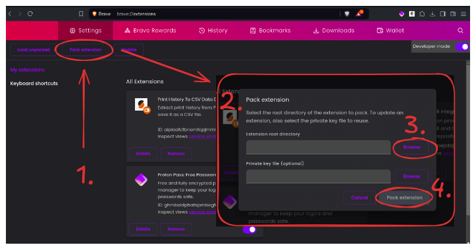
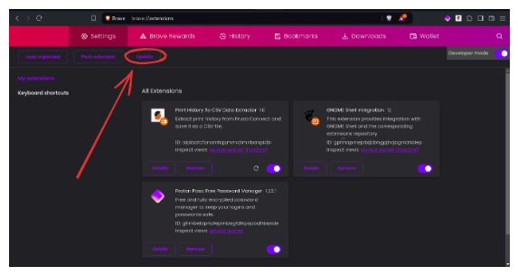
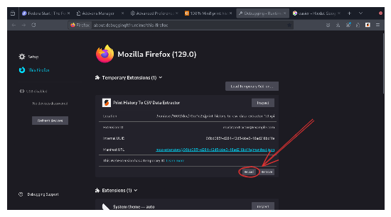

Certainly! Here's the updated README with callouts added where appropriate:

# Prusa Print History Downloader

**Prusa Print History Downloader** is a Chrome and Firefox extension that allows users to download their print history from the Prusa Connect Cloud effortlessly.

<p align="center">
  
</p>

## Features

- **Download Print History**: Easily download your print history from Prusa Connect as a CSV file.
- **Progress Tracking**: View real-time progress during the data extraction process.
- **Multiple Printer Support**: Fetch print job data from multiple printers simultaneously.
- **Organized File Naming**: CSV files are automatically named using the printer's name and the current date (e.g., `PrinterName_10-10-2024.csv`).
- **User Notifications**: Receive clear notifications for connection status, errors, and successful downloads.

## Preview

<p align="center">
  
</p>

<p align="center">
  
</p>

<p align="center">
  
</p>

## Table of Contents

- [Prusa Print History Downloader](#prusa-print-history-downloader)
  - [Features](#features)
  - [Preview](#preview)
  - [Table of Contents](#table-of-contents)
  - [Quick Start](#quick-start)
    - [Chrome Extension](#chrome-extension)
      - [Load Unpacked Method](#load-unpacked-method)
    - [Firefox Extension](#firefox-extension)
      - [Temporary Add-on Method](#temporary-add-on-method)
  - [Usage](#usage)
  - [Developer Guide](#developer-guide)
    - [Building the Extension](#building-the-extension)
      - [Chrome](#chrome)
      - [Firefox](#firefox)
        - [Prerequisites](#prerequisites)
        - [Build the Extension](#build-the-extension)
    - [Packaging the Extension](#packaging-the-extension)
      - [Chrome](#chrome-1)
      - [Firefox](#firefox-1)
    - [Updating the Extension](#updating-the-extension)
      - [Chrome](#chrome-2)
      - [Firefox](#firefox-2)
  - [Contributing](#contributing)
  - [License](#license)

---

## Quick Start

Get up and running quickly with the easiest installation methods.

### Chrome Extension

#### Load Unpacked Method

1. **Download the Extension Files**:
   - Clone or download the extension's source code to your local machine.

2. **Open Chrome Extensions Page**:
   - Navigate to `chrome://extensions/` in your Chrome browser.

3. **Enable Developer Mode**:
   - Toggle the **Developer mode** switch in the top right corner.
     <p align="center">
       
     </p>

4. **Load the Unpacked Extension**:
   - Click on **Load unpacked**.
   - Select the folder containing the extension files.
     <p align="center">
       
     </p>

5. **Confirm Installation**:
   - The extension should now appear in your list of extensions and be ready to use.

### Firefox Extension

#### Temporary Add-on Method

1. **Download the Extension Files**:
   - Clone or download the extension's source code to your local machine.

2. **Open Firefox and Navigate to Debugging Page**:
   - Enter `about:debugging#/runtime/this-firefox` in the address bar.

3. **Load Temporary Add-on**:
   - Click on **Load Temporary Add-on...**.
   - Select the `manifest.json` file from your extension directory.
     <p align="center">
       
     </p>

4. **Confirm Installation**:
   - The extension will be loaded temporarily and will remain active until you restart Firefox.

> [!WARNING]
> **Temporary add-ons are removed when Firefox restarts.** You'll need to reload them each time you open Firefox.

---

## Usage

1. **Access Prusa Connect Cloud**:
   - Visit [Prusa Connect Cloud](https://connect.prusa3d.com) and log in.

2. **Open the Extension**:
   - Click on the Prusa Print History Downloader icon in your browser toolbar.

3. **Extract Data**:
   - In the extension popup, click on the **Extract data** button.

4. **Download CSV File**:
   - Choose the destination folder for the downloaded `.zip` file containing your CSV files.

---

## Developer Guide

For those who wish to build, package, and update the extension, follow the steps below.

### Building the Extension

#### Chrome

No additional build steps are required for Chrome. Ensure all necessary files are organized within a single directory.

#### Firefox

##### Prerequisites

- **Node.js and npm**: Ensure they are installed on your system.
- **web-ext**: Install globally using:

  ```bash
  npm install -g web-ext
  ```

##### Build the Extension

1. **Navigate to Extension Directory**:

   ```bash
   cd path/to/your/extension
   ```

2. **Build the Extension**:

   ```bash
   web-ext build
   ```

   - The `.xpi` file will be generated inside the `web-ext-artifacts` directory.

### Packaging the Extension

#### Chrome

1. **Go to Extensions Page**:
   - Navigate to `chrome://extensions/`.

2. **Enable Developer Mode**:
   - Toggle the **Developer mode** switch.

3. **Pack Extension**:
   - Click **Pack extension...**.
   - Select your extension's root directory.
   - Optionally, provide the existing private key (`.pem` file) if updating.
     <p align="center">
       
     </p>

4. **Obtain `.crx` and `.pem` Files**:
   - Chrome will generate a `.crx` file and a private key (`.pem`) file.

#### Firefox

1. **Build the Extension**:

   ```bash
   web-ext build
   ```

2. **Distribute the `.xpi` File**:
   - Use the generated `.xpi` file for distribution or upload to Mozilla's Add-ons site.

### Updating the Extension

#### Chrome

1. **Make Changes**:
   - Modify your extension files as needed.

2. **Reload the Extension**:
   - Go to `chrome://extensions/`.
   - Ensure **Developer mode** is enabled.
   - Click the **Update** button to refresh all extensions.
     <p align="center">
       
     </p>

#### Firefox

1. **Modify Files**:
   - Update your extension code.

2. **Reload the Extension**:
   - Navigate to `about:debugging#/runtime/this-firefox`.
   - Click **Reload** next to your extension.
     <p align="center">
       
     </p>

> [!IMPORTANT]
> **Remember that temporary add-ons are removed when Firefox restarts.** You'll need to reload them each time during development.

---

## Contributing

Contributions are welcome! Please feel free to open an issue or submit a pull request.

---

## License

This project is licensed under the [MIT License](LICENSE).

---

Feel free to reach out if you have any questions or need assistance using the Prusa Print History Downloader.
